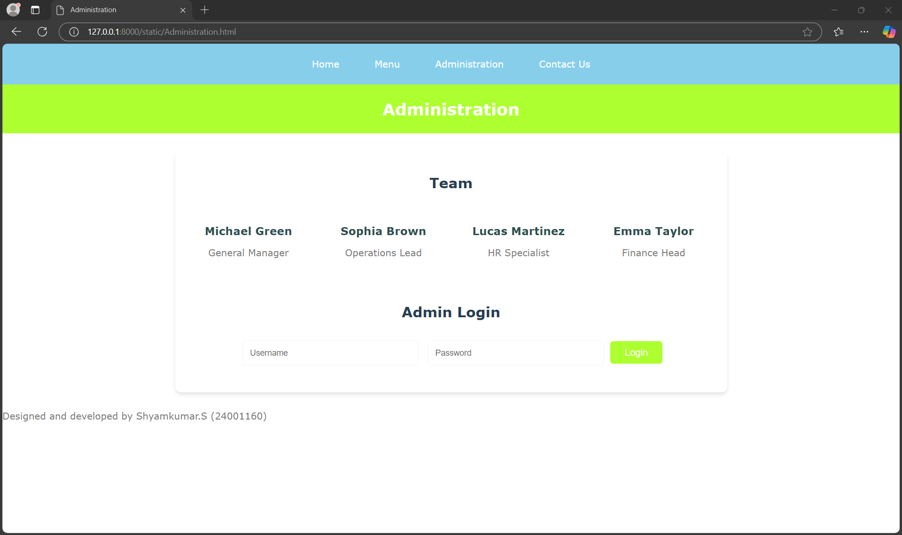
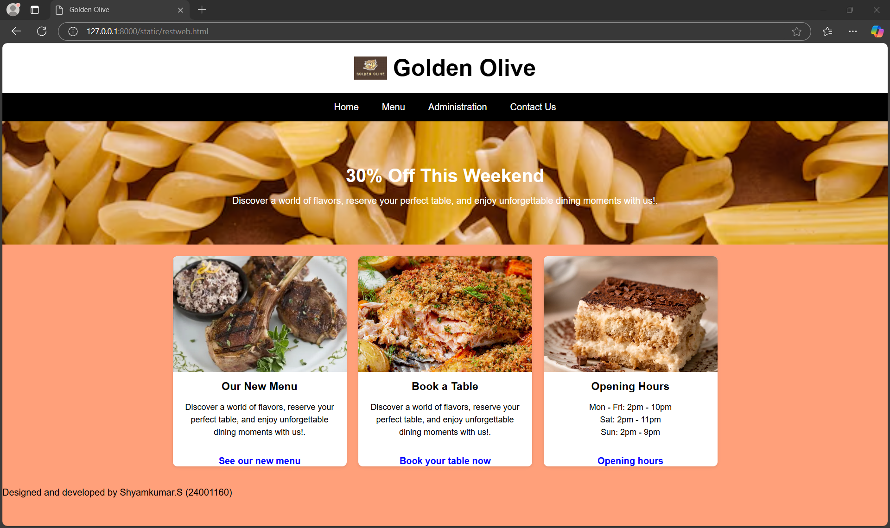
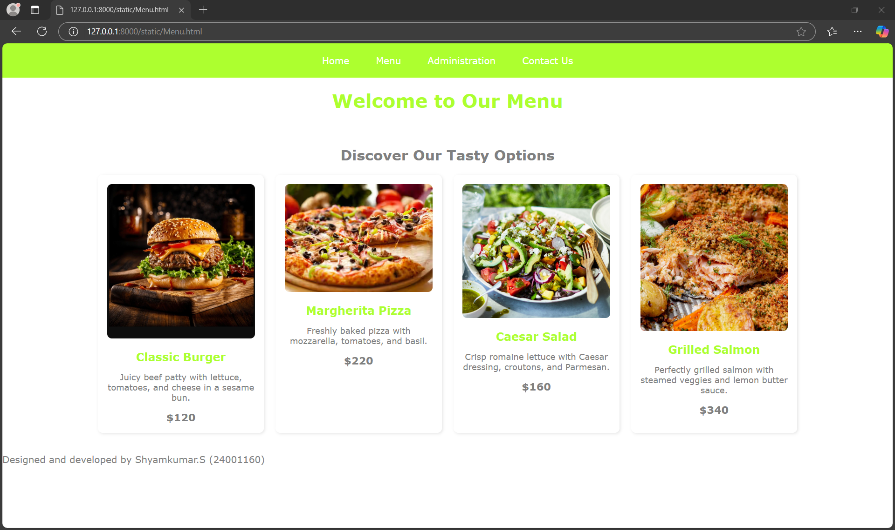
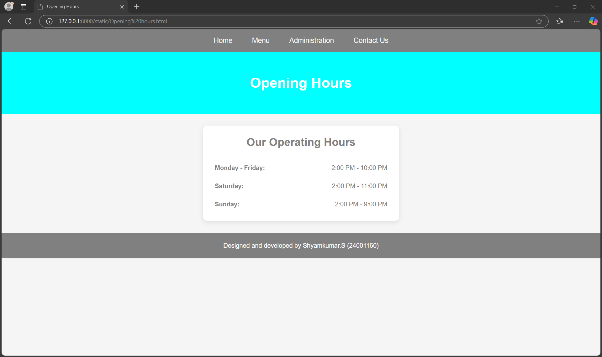
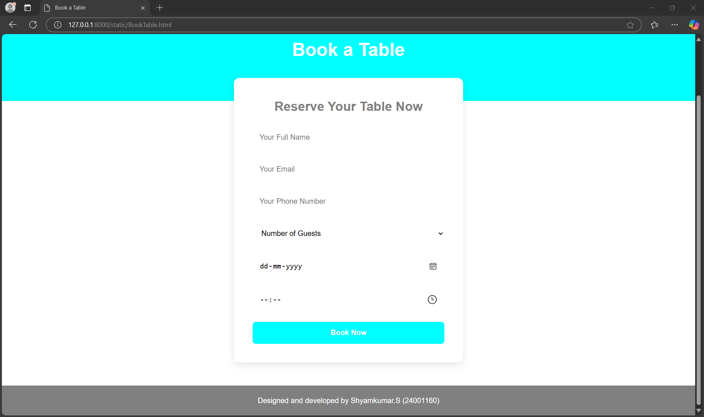

# Ex.07 Restaurant Website
## Date:17/12/2024

## AIM:
To develop a static Restaurant website to display the food items and services provided by them.

## DESIGN STEPS:

### Step 1:
Requirement collection.

### Step 2:
Creating the layout using HTML and CSS.

### Step 3:
Updating the sample content.

### Step 4:
Choose the appropriate style and color scheme.

### Step 5:
Validate the layout in various browsers.

### Step 6:
Validate the HTML code.

### Step 7:
Publish the website in the given URL.

## PROGRAM:

Home
```

<html>
<head>
    <meta charset="UTF-8">
    <meta name="viewport" content="width=device-width, initial-scale=1.0">
    <title>Golden Olive</title>
    <style>
        body 
        {
            font-family: Arial, sans-serif;
            margin: 0;
            padding: 0;
            background-color: lightsalmon;
            color: black;
        }
        header 
        {
            background-color: white;
            text-align: center;
            padding: 20px;
        }
        header h1 
        {
            margin: 0;
            font-size: 2.5em;
            display: flex;
            justify-content: center;
            align-items: center;
            gap: 10px;
        }
        header h1 img 
        {
            height: 40px;
        }
        nav 
        {
            background-color: black;
            display: flex;
            justify-content: center;
        }
        nav a 
        {
            color: white;
            text-decoration: none;
            padding: 15px 20px;
            display: inline-block;
        }
        nav a:hover 
        {
            background-color: sandybrown;
        }
        .banner 
        {
            background-image: url('pasta.avif');
            background-size: cover;
            background-position: center;
            text-align: center;
            color: white;
            padding: 50px 20px;
        }
        .banner h2 
        {
            font-size: 2em;
            margin-bottom: 10px;
        }
        .grid 
        {
            display: flex;
            justify-content: center;
            gap: 20px;
            padding: 20px;
            flex-wrap: wrap;
        }
        .card 
        {
            background-color: white;
            border-radius: 8px;
            box-shadow: 0 2px 5px rgba(0, 0, 0, 0.1);
            overflow: hidden;
            text-align: center;
            width: 300px;
        }
        .card img 
        {
            width: 100%;
            height: 200px;
            object-fit: cover;
        }
        .card h3 
        {
            margin: 15px 0 10px;
        }
        .card p 
        {
            padding: 0 15px 15px;
            font-size: 0.9em;
            line-height: 1.5;
        }
        .card a 
        {
            text-decoration: none;
            color: blue;
            font-weight: bold;
        }
        .card a:hover
        {
            text-decoration: underline;
        }
    </style>
</head>
<body>
    <header>
        <h1> Golden Olive</h1>
    </header>
    <nav>
        <a href="restweb.html">Home</a>
        <a href="Menu.html">Menu</a>
        <a href="Administration.html">Administration</a>
        <a href="Contact Us.html">Contact Us</a>
    </nav>
    <section class="banner">
        <h2>30% Off This Weekend</h2>
        <p>Discover a world of flavors, reserve your perfect table, and enjoy unforgettable dining moments with us!.</p>
    </section>
    <section class="grid">
        <div class="card">
            
            <h3>Our New Menu</h3>
            <p>Discover a world of flavors, reserve your perfect table, and enjoy unforgettable dining moments with us!.</p>
            <a href="Menu.html">See our new menu</a>
        </div>
        <div class="card">
            
            <h3>Book a Table</h3>
            <p>Discover a world of flavors, reserve your perfect table, and enjoy unforgettable dining moments with us!.</p>
            <a href="BookTable.html">Book your table now</a>
        </div>
        <div class="card">
            
            <h3>Opening Hours</h3>
            <p>Mon - Fri: 2pm - 10pm<br>Sat: 2pm - 11pm<br>Sun: 2pm - 9pm</p>
            <a href="Opening hours.html">Opening hours</a>
        </div>
    </section>
    <footer>
        <p>Designed and developed by Shyamkumar.S (24001160)</p>
    </footer>
</body>
</html>

```
Menu

```
<html>
<head>
    <style>
        body 
        {
            font-family: Verdana, sans-serif;
            margin: 0;
            padding: 0;
            background-color: white;
            color: gray;
        }
        nav 
        {
            background-color: greenyellow;
            overflow: hidden;
            padding: 10px 0;
            text-align: center;
        }
        nav a 
        {
            color: white;
            text-decoration: none;
            padding: 10px 20px;
            display: inline-block;
            transition: background-color 0.3s;
        }
        nav a:hover 
        {
            background-color: greenyellow;
        }
        header 
        {
            background-color: white;
            text-align: center;
            padding: 20px;
        }
        header h1 
        {
            color: greenyellow;
            margin: 0;
        }
        .menu-section 
        {
            padding: 20px;
            max-width: 1200px;
            margin: auto;
        }
        .menu-title 
        {
            text-align: center;
            margin-bottom: 20px;
            font-size: 1.5em;
            color: gray;
        }
        .menu-items 
        {
            display: grid;
            grid-template-columns: repeat(auto-fit, minmax(250px, 1fr));
            gap: 20px;
            justify-content: center;
        }
        .menu-item 
        {
            background-color: white;
            border: 1px solid white;
            border-radius: 8px;
            box-shadow: 2px 2px 5px rgba(0, 0, 0, 0.1);
            padding: 15px;
            text-align: center;
            transition: transform 0.3s;
        }
        .menu-item:hover 
        {
            transform: translateY(-5px);
        }
        .menu-item img 
        {
            max-width: 100%;
            border-radius: 8px;
            margin-bottom: 10px;
        }
        .menu-item h3 
        {
            font-size: 1.2em;
            color: greenyellow;
            margin: 10px 0;
        }
        .menu-item p 
        {
            font-size: 0.9em;
            color: gray;
        }
        .menu-item span 
        {
            font-size: 1.1em;
            font-weight: bold;
            color: gray;
            display: block;
            margin-top: 10px;
        }
    </style>
</head>
<body>

<nav>
    <a href="restweb.html">Home</a>
    <a href="Menu.html">Menu</a>
    <a href="Administration.html">Administration</a>
    <a href="Contact Us.html">Contact Us</a>
</nav>

<header>
    <h1>Welcome to Our Menu</h1>
</header>

<div class="menu-section">
    <h2 class="menu-title">Discover Our Tasty Options</h2>
    <div class="menu-items">
        <div class="menu-item">
            
            <h3>Classic Burger</h3>
            <p>Juicy beef patty with lettuce, tomatoes, and cheese in a sesame bun.</p>
            <span>$120</span>
        </div>
        <div class="menu-item">
            
            <h3>Margherita Pizza</h3>
            <p>Freshly baked pizza with mozzarella, tomatoes, and basil.</p>
            <span>$220</span>
        </div>
        <div class="menu-item">
            
            <h3>Caesar Salad</h3>
            <p>Crisp romaine lettuce with Caesar dressing, croutons, and Parmesan.</p>
            <span>$160</span>
        </div>
        <div class="menu-item">
            
            <h3>Grilled Salmon</h3>
            <p>Perfectly grilled salmon with steamed veggies and lemon butter sauce.</p>
            <span>$340</span>
        </div>
    </div>
</div>
<footer>
        <p>Designed and developed by Shyamkumar.S (24001160)</p>
</footer>
</body>
</html>

```
Opening hours

```
<html>
<head>
    <meta charset="UTF-8">
    <meta name="viewport" content="width=device-width, initial-scale=1.0">
    <title>Opening Hours</title>
    <style>
        * {
            margin: 0;
            padding: 0;
            box-sizing: border-box;
        }
        body 
        {
            font-family: 'Arial', sans-serif;
            background-color: whitesmoke;
            color: gray;
            line-height: 1.6;
        }
        nav 
        {
            background-color: gray;
            padding: 15px 0;
            display: flex;
            justify-content: center;
            align-items: center;
        }
        nav a 
        {
            text-decoration: none;
            color: whitesmoke;
            margin: 0 25px;
            font-size: 18px;
            transition: color 0.3s ease;
        }
        nav a:hover 
        {
            color: cyan;
        }
        header 
        {
            background: cyan;
            color: white;
            text-align: center;
            padding: 50px 20px;
            font-size: 36px;
            font-weight: bold;
        }
        .hours-section 
        {
            max-width: 500px;
            margin: 30px auto;
            background-color: white;
            border-radius: 10px;
            box-shadow: 0 4px 12px rgba(0, 0, 0, 0.1);
            padding: 20px 30px;
        }
        .hours-section h2 
        {
            font-size: 28px;
            color: gray;
            text-align: center;
            margin-bottom: 20px;
        }
        .hours-list 
        {
            list-style: none;
            padding: 0;
        }
        .hours-list li 
        {
            display: flex;
            justify-content: space-between;
            padding: 10px 0;
            border-bottom: 1px solid white;
        }
        .hours-list li:last-child 
        {
            border-bottom: none;
        }
        .hours-list span 
        {
            font-weight: bold;
            color: gray;
        }
        footer 
        {
            text-align: center;
            padding: 20px;
            background-color: gray;
            color: white;
            margin-top: 30px;
        }
    </style>
</head>
<body>

<nav>
    <a href="restweb.html">Home</a>
    <a href="Menu.html">Menu</a>
    <a href="Administration.html">Administration</a>
    <a href="Contact Us.html">Contact Us</a>
</nav>

<header>
    Opening Hours
</header>

<div class="hours-section">
    <h2>Our Operating Hours</h2>
    <ul class="hours-list">
        <li><span>Monday - Friday:</span> 2:00 PM - 10:00 PM</li>
        <li><span>Saturday:</span> 2:00 PM - 11:00 PM</li>
        <li><span>Sunday:</span> 2:00 PM - 9:00 PM</li>
    </ul>
</div>
<footer>
        <p>Designed and developed by Shyamkumar.S (24001160)</p>
</footer>
</body>
</html>

```
BookTable

```
<html>
<head>
    <meta charset="UTF-8">
    <meta name="viewport" content="width=device-width, initial-scale=1.0">
    <title>Book a Table</title>
    <style>
        * {
            margin: 0;
            padding: 0;
            box-sizing: border-box;
        }
        body 
        {
            font-family: 'Helvetica Neue', Arial, sans-serif;
            background-color: white;
            color: gray;
            line-height: 1.6;
        }
        nav 
        {
            background-color: gray;
            display: flex;
            justify-content: center;
            align-items: center;
            padding: 15px 0;
        }
        nav a 
        {
            text-decoration: none;
            color: white;
            margin: 0 25px;
            font-size: 18px;
            transition: color 0.3s ease;
        }
        nav a:hover 
        {
            color: cyan;
        }
        header 
        {
            background: cyan;
            color: white;
            text-align: center;
            padding: 80px 20px;
            font-size: 40px;
            font-weight: bold;
        }
        .booking-section 
        {
            background-color: white;
            border-radius: 12px;
            box-shadow: 0 6px 15px rgba(0, 0, 0, 0.1);
            width: 80%;
            max-width: 500px;
            margin: -50px auto 50px;
            padding: 40px;
        }
        .booking-section h2 
        {
            color: gray;
            font-size: 28px;
            text-align: center;
            margin-bottom: 20px;
        }
        .booking-form 
        {
            display: flex;
            flex-direction: column;
            gap: 20px;
        }
        .booking-form input, .booking-form select, .booking-form button 
        {
            padding: 15px;
            font-size: 16px;
            border: 1px solid white;
            border-radius: 8px;
        }
        .booking-form input:focus, .booking-form select:focus 
        {
            outline-color: cyan;
            border-color: cyan;
        }
        .booking-form button 
        {
            background-color: cyan;
            color: white;
            font-weight: bold;
            cursor: pointer;
            transition: background-color 0.3s ease;
        }
        .booking-form button:hover 
        {
            background-color: cyan;
        }
        footer 
        {
            text-align: center;
            padding: 20px;
            background-color: gray;
            color: white;
        }
    </style>
</head>
<body>

<nav>
    <a href="restweb.html">Home</a>
    <a href="Menu.html">Menu</a>
    <a href="Administration.html">Administration</a>
    <a href="Contact Us.html">Contact Us</a>
</nav>

<header>
    Book a Table
</header>

<div class="booking-section">
    <h2>Reserve Your Table Now</h2>
    <form class="booking-form">
        <input type="text" name="name" placeholder="Your Full Name" required>
        <input type="email" name="email" placeholder="Your Email" required>
        <input type="tel" name="phone" placeholder="Your Phone Number" required>
        <select name="guests" required>
            <option value="" disabled selected>Number of Guests</option>
            <option value="1">1 Guest</option>
            <option value="2">2 Guests</option>
            <option value="3">3 Guests</option>
            <option value="4">4 Guests</option>
            <option value="5+">6+ Guests</option>
        </select>
        <input type="date" name="date" required>
        <input type="time" name="time" required>
        <button type="submit">Book Now</button>
    </form>
</div>
<footer>
        <p>Designed and developed by Shyamkumar.S (24001160)</p>
</footer>
</body>
</html>

```
Contact

```
<html>
<head>
    <title>Contact Us</title>
    <style>
        body 
        {
            font-family: "Segoe UI", sans-serif;
            margin: 0;
            padding: 0;
            background: linear-gradient(to bottom, white, white);
            color: gray;
        }
        nav 
        {
            background-color: gray;
            display: flex;
            justify-content: space-between;
            align-items: center;
            padding: 10px 30px;
        }
        nav a 
        {
            color: white;
            text-decoration: none;
            font-size: 16px;
            margin: 0 10px;
            transition: color 0.3s;
        }
        nav a:hover 
        {
            color: white;
        }
        header 
        {
            background-color: gray;
            color: white;
            text-align: center;
            padding: 40px 20px;
        }
        header h1 
        {
            margin: 0;
            font-size: 36px;
        }
        .contact-container 
        {
            display: flex;
            flex-wrap: wrap;
            justify-content: space-around;
            padding: 20px;
            max-width: 1200px;
            margin: 20px auto;
            background: white;
            box-shadow: 0 4px 8px rgba(0, 0, 0, 0.1);
            border-radius: 8px;
        }
        .contact-details 
        {
            flex: 1 1 40%;
            margin: 20px;
            color: gray;
        }
        .contact-details h2 
        {
            font-size: 24px;
            margin-bottom: 10px;
        }
        .contact-details p 
        {
            font-size: 16px;
            line-height: 1.6;
            margin: 8px 0;
        }
        .contact-form 
        {
            flex: 1 1 40%;
            margin: 20px;
        }
        .contact-form h2 
        {
            font-size: 24px;
            margin-bottom: 15px;
        }
        .contact-form form 
        {
            display: flex;
            flex-direction: column;
            gap: 15px;
        }
        .contact-form input, .contact-form textarea, .contact-form button 
        {
            padding: 12px;
            font-size: 16px;
            border: 1px solid white;
            border-radius: 5px;
        }
        .contact-form textarea 
        {
            resize: none;
            height: 100px;
        }
        .contact-form button 
        {
            background-color: gray;
            color: white;
            cursor: pointer;
            transition: background-color 0.3s;
        }
        .contact-form button:hover 
        {
            background-color: gray;
        }
        footer 
        {
            background-color: gray;
            color: white;
            text-align: center;
            padding: 10px 0;
            margin-top: 20px;
        }
        footer p 
        {
            margin: 0;
            font-size: 14px;
        }
    </style>
</head>
<body>

<nav>
    <a href="restweb.html">Home</a>
    <a href="Menu.html">Menu</a>
    <a href="Administration.html">Administration</a>
    <a href="Contact Us.html">Contact Us</a>
</nav>

<header>
    <h1>Contact Us</h1>
</header>

<div class="contact-container">
    <div class="contact-details">
        <h2>Get in Touch</h2>
        <p><strong>Address:</strong> 123 Main Street, City, Country</p>
        <p><strong>Phone:</strong> +123 456 7890</p>
        <p><strong>Email:</strong> contact@Olive.com</p>
        <p>We’re here to help and answer any questions you might have. We look forward to hearing from you!</p>
    </div>

    <div class="contact-form">
        <h2>Send Us a Message</h2>
        <form>
            <input type="text" name="name" placeholder="Your Full Name" required>
            <input type="email" name="email" placeholder="Your Email" required>
            <textarea name="message" placeholder="Your Message..." required></textarea>
            <button type="submit">Submit</button>
        </form>
    </div>
</div>
<footer>
        <p>Designed and developed by Shyamkumar.S (24001160)</p>
</footer>
</body>
</html>

```
Administration

```
<html>
<head>
    <title>Administration</title>
    <style>
        body 
        {
            font-family: "Verdana", sans-serif;
            margin: 0;
            padding: 0;
            background-color: white;
            color: gray;
        }
        nav 
        {
            background-color: skyblue;
            color: white;
            display: flex;
            justify-content: center;
            padding: 15px 0;
        }
        nav a 
        {
            text-decoration: none;
            color: white;
            font-size: 16px;
            padding: 10px 20px;
            border-radius: 5px;
            margin: 0 10px;
            transition: background-color 0.3s;
        }
        nav a:hover 
        {
            background-color: gray;
        }
        header 
        {
            background-color: greenyellow;
            color: white;
            padding: 25px 0;
            text-align: center;
        }
        header h1 
        {
            margin: 0;
            font-size: 28px;
        }
        .admin-section 
        {
            padding: 20px;
            max-width: 900px;
            margin: 30px auto;
            background-color: white;
            border-radius: 10px;
            box-shadow: 0 4px 6px rgba(0, 0, 0, 0.1);
        }
        .admin-section h2 
        {
            text-align: center;
            color: #283e51;
            margin-bottom: 25px;
        }
        .admin-team 
        {
            display: grid;
            grid-template-columns: repeat(auto-fit, minmax(200px, 1fr));
            gap: 20px;
            justify-content: center;
        }
        .team-member 
        {
            background-color: white;
            border: 1px solid white;
            border-radius: 8px;
            padding: 20px;
            text-align: center;
            transition: transform 0.3s, box-shadow 0.3s;
        }
        .team-member:hover 
        {
            transform: translateY(-5px);
            box-shadow: 0 6px 10px rgba(0, 0, 0, 0.15);
        }
        .team-member h3 
        {
            color: darkslategrey;
            margin: 10px 0;
        }
        .team-member p 
        {
            color: gray;
        }
        .admin-login 
        {
            margin-top: 40px;
            text-align: center;
        }
        .admin-login input 
        {
            padding: 12px;
            margin: 10px 5px;
            border: 1px solid whitesmoke;
            border-radius: 5px;
            font-size: 14px;
            width: 80%;
            max-width: 300px;
        }
        .admin-login button 
        {
            padding: 10px 25px;
            background-color: greenyellow;
            color: white;
            border: none;
            border-radius: 5px;
            font-size: 16px;
            cursor: pointer;
            transition: background-color 0.3s;
        }
        .admin-login button:hover 
        {
            background-color: greenyellow;
        }
        @media (max-width: 600px) 
        {
            nav a 
            {
                font-size: 14px;
                padding: 8px 15px;
            }
            .team-member 
            {
                padding: 15px;
            }
        }
    </style>
</head>
<body>

<nav>
    <a href="restweb.html">Home</a>
    <a href="Menu.html">Menu</a>
    <a href="Administration.html">Administration</a>
    <a href="Contact Us.html">Contact Us</a>
</nav>

<header>
    <h1>Administration</h1>
</header>

<div class="admin-section">
    <h2>Team</h2>
    <div class="admin-team">
        <div class="team-member">
            <h3>Michael Green</h3>
            <p>General Manager</p>
        </div>
        <div class="team-member">
            <h3>Sophia Brown</h3>
            <p>Operations Lead</p>
        </div>
        <div class="team-member">
            <h3>Lucas Martinez</h3>
            <p>HR Specialist</p>
        </div>
        <div class="team-member">
            <h3>Emma Taylor</h3>
            <p>Finance Head</p>
        </div>
    </div>

    <div class="admin-login">
        <h2>Admin Login</h2>
        <form>
            <input type="text" placeholder="Username" required>
            <input type="password" placeholder="Password" required>
            <button type="submit">Login</button>
        </form>
    </div>
</div>
<footer>
        <p>Designed and developed by Shyamkumar.S (24001160)</p>
</footer>
</body>
</html>

```

## OUTPUT:



 

 






## RESULT:
The program for designing software company website using HTML and CSS is completed successfully.
