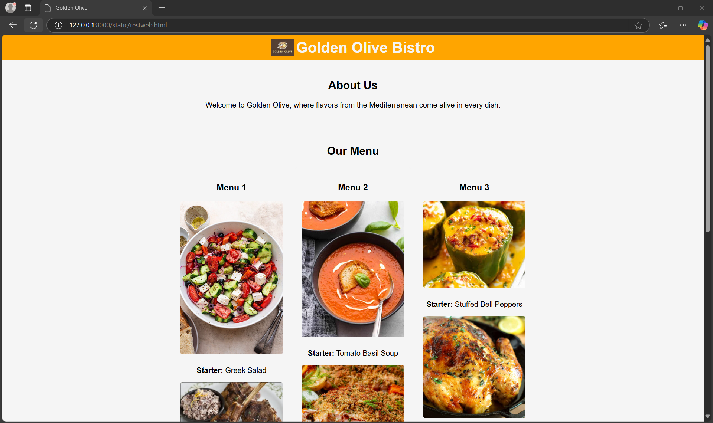
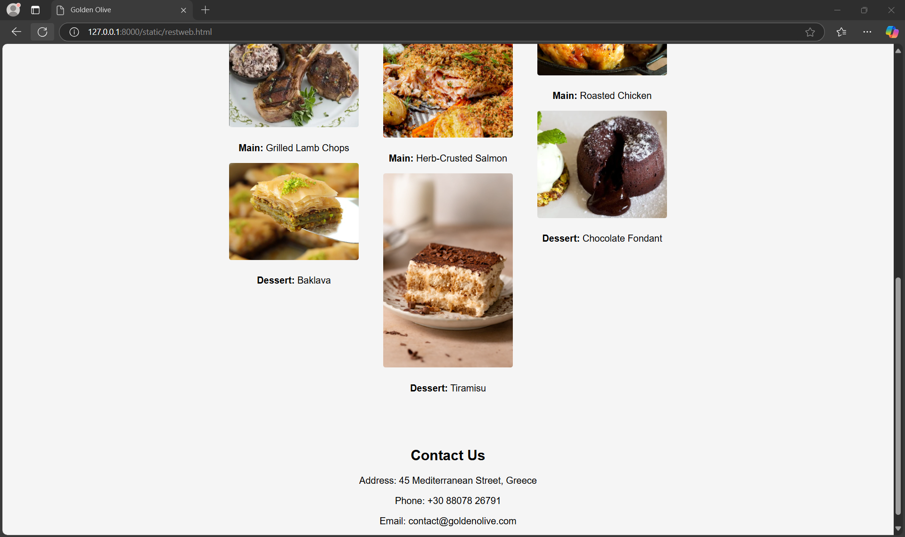

# Ex.07 Restaurant Website
## Date:10/12/2024

## AIM:
To develop a static Restaurant website to display the food items and services provided by them.

## DESIGN STEPS:

### Step 1:
Requirement collection.

### Step 2:
Creating the layout using HTML and CSS.

### Step 3:
Updating the sample content.

### Step 4:
Choose the appropriate style and color scheme.

### Step 5:
Validate the layout in various browsers.

### Step 6:
Validate the HTML code.

### Step 7:
Publish the website in the given URL.

## PROGRAM:

```

<html>
<head>
    <meta charset="UTF-8">
    <meta name="viewport" content="width=device-width, initial-scale=1.0">
    <title>Golden Olive</title>
    <style>
        body {
            font-family: Arial, sans-serif;
            margin: 0;
            padding: 0;
            background-color: whitesmoke;
            color: black;
        }
        header {
            background-color: orange;
            color: whitesmoke;
            padding: 10px;
            text-align: center;
        }
        header img {
            max-width: 50px;
            vertical-align: middle;
        }
        header h1 {
            display: inline-block;
            margin: 0;
            font-size: 2rem;
            vertical-align: middle;
        }
        section {
            padding: 20px;
            text-align: center;
        }
        .menu {
            display: flex;
            justify-content: center;
            flex-wrap: wrap;
            gap: 10px;
        }
        .menu-card {
            width: 220px;
            padding: 15px;
            background-color: whitesmoke;
            border: 1px solid whitesmoke;
            border-radius: 8px;
        }
        .menu-card img {
            max-width: 100%;
            border-radius: 4px;
            margin-bottom: 10px;
        }
        .contact {
            padding: 20px;
            background-color: whitesmoke;
        }
    </style>
</head>
<body>

<header>
    
    <h1>Golden Olive Bistro</h1>
</header>

<section>
    <h2>About Us</h2>
    <p>Welcome to Golden Olive, where flavors from the Mediterranean come alive in every dish.</p>
</section>

<section>
    <h2>Our Menu</h2>
    <div class="menu">
        <div class="menu-card">
            <h3>Menu 1</h3>
            
            <p><strong>Starter:</strong> Greek Salad</p>
            
            <p><strong>Main:</strong> Grilled Lamb Chops</p>
            
            <p><strong>Dessert:</strong> Baklava</p>
        </div>
        <div class="menu-card">
            <h3>Menu 2</h3>
            
            <p><strong>Starter:</strong> Tomato Basil Soup</p>
            
            <p><strong>Main:</strong> Herb-Crusted Salmon</p>
            
            <p><strong>Dessert:</strong> Tiramisu</p>
        </div>
        <div class="menu-card">
            <h3>Menu 3</h3>
            
            <p><strong>Starter:</strong> Stuffed Bell Peppers</p>
            
            <p><strong>Main:</strong> Roasted Chicken</p>
            
            <p><strong>Dessert:</strong> Chocolate Fondant</p>
        </div>
    </div>
</section>

<section class="contact">
    <h2>Contact Us</h2>
    <p>Address: 45 Mediterranean Street, Greece</p>
    <p>Phone: +30 88078 26791</p>
    <p>Email: contact@goldenolive.com</p>
</section>
</body>
</html>

```

## OUTPUT:




## RESULT:
The program for designing software company website using HTML and CSS is completed successfully.
