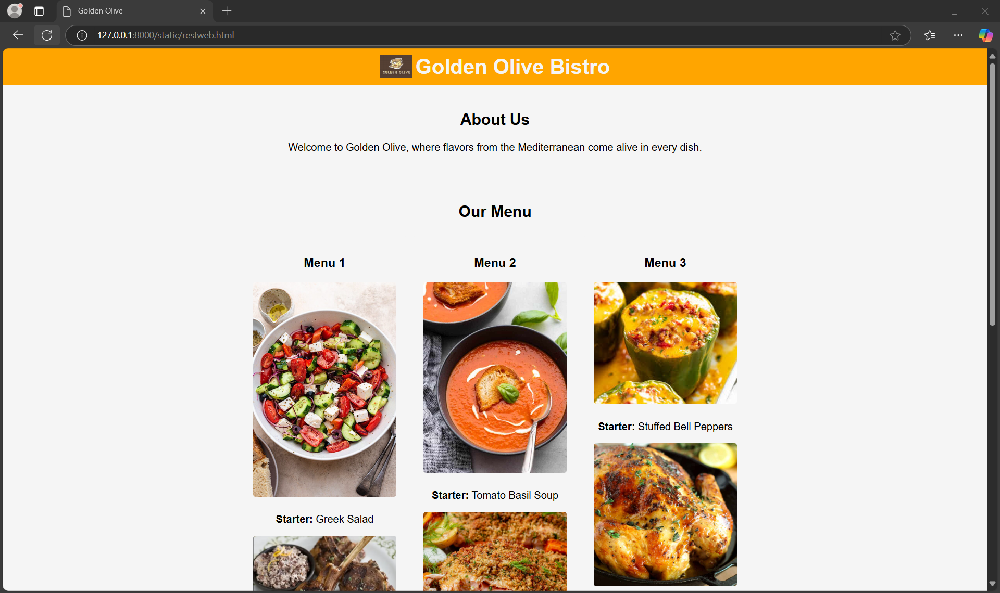

# Ex.07 Restaurant Website
## Date:11/12/2024

## AIM:
To develop a static Restaurant website to display the food items and services provided by them.

## DESIGN STEPS:

### Step 1:
Requirement collection.

### Step 2:
Creating the layout using HTML and CSS.

### Step 3:
Updating the sample content.

### Step 4:
Choose the appropriate style and color scheme.

### Step 5:
Validate the layout in various browsers.

### Step 6:
Validate the HTML code.

### Step 7:
Publish the website in the given URL.

## PROGRAM:

```

<html>
<head>
    <meta charset="UTF-8">
    <meta name="viewport" content="width=device-width, initial-scale=1.0">
    <title>Golden Olive</title>
    <style>
        body 
        {
            font-family: Arial, sans-serif;
            margin: 0;
            padding: 0;
            background-color: lightsalmon;
            color: black;
        }
        header 
        {
            background-color: white;
            text-align: center;
            padding: 20px;
        }
        header h1 
        {
            margin: 0;
            font-size: 2.5em;
            display: flex;
            justify-content: center;
            align-items: center;
            gap: 10px;
        }
        header h1 img 
        {
            height: 40px;
        }
        nav 
        {
            background-color: black;
            display: flex;
            justify-content: center;
        }
        nav a 
        {
            color: white;
            text-decoration: none;
            padding: 15px 20px;
            display: inline-block;
        }
        nav a:hover 
        {
            background-color: sandybrown;
        }
        .banner 
        {
            background-image: url('pasta.avif');
            background-size: cover;
            background-position: center;
            text-align: center;
            color: white;
            padding: 50px 20px;
        }
        .banner h2 
        {
            font-size: 2em;
            margin-bottom: 10px;
        }
        .grid 
        {
            display: flex;
            justify-content: center;
            gap: 20px;
            padding: 20px;
            flex-wrap: wrap;
        }
        .card 
        {
            background-color: white;
            border-radius: 8px;
            box-shadow: 0 2px 5px rgba(0, 0, 0, 0.1);
            overflow: hidden;
            text-align: center;
            width: 300px;
        }
        .card img 
        {
            width: 100%;
            height: 200px;
            object-fit: cover;
        }
        .card h3 
        {
            margin: 15px 0 10px;
        }
        .card p 
        {
            padding: 0 15px 15px;
            font-size: 0.9em;
            line-height: 1.5;
        }
        .card a 
        {
            text-decoration: none;
            color: blue;
            font-weight: bold;
        }
        .card a:hover 
        {
            text-decoration: underline;
        }
    </style>
</head>
<body>
    <header>
        <h1> Golden Olive</h1>
    </header>
    <nav>
        <a>Home</a>
        <a>Menu</a>
        <a>Administration</a>
        <a>Contact Us</a>
    </nav>
    <section class="banner">
        <h2>30% Off This Weekend</h2>
        <p>Discover a world of flavors, reserve your perfect table, and enjoy unforgettable dining moments with us!.</p>
    </section>
    <section class="grid">
        <div class="card">
            
            <h3>Our New Menu</h3>
            <p>Discover a world of flavors, reserve your perfect table, and enjoy unforgettable dining moments with us!.</p>
            <a>See our new menu</a>
        </div>
        <div class="card">
            
            <h3>Book a Table</h3>
            <p>Discover a world of flavors, reserve your perfect table, and enjoy unforgettable dining moments with us!.</p>
            <a>Book your table now</a>
        </div>
        <div class="card">
            
            <h3>Opening Hours</h3>
            <p>Mon - Fri: 2pm - 10pm<br>Sat: 2pm - 11pm<br>Sun: 2pm - 9pm</p>
        </div>
    </section>
</body>
</html>

```

## OUTPUT:



## RESULT:
The program for designing software company website using HTML and CSS is completed successfully.
